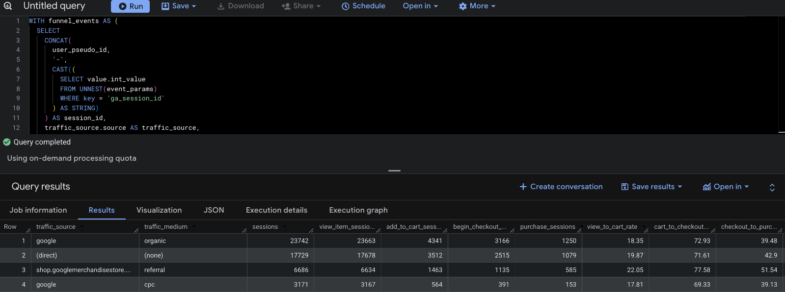

# SQL Acquisition Funnel Analysis  
### When Traffic Volume Hides Conversion Quality

A session-level SQL analysis in BigQuery using Google’s GA4 sample ecommerce dataset to test whether the highest-volume acquisition channel was also the highest-quality channel.

*Source-level funnel comparison showing that organic search led on volume, while direct and referral traffic showed stronger purchase efficiency.*

## Project Question

Google organic appeared strongest on top-line volume.  
This project tests whether that volume leadership also held when channel quality was measured by progression from product view to purchase.

## Dataset

This project uses **Google’s GA4 sample ecommerce dataset** in **BigQuery**.

## Tools

- **BigQuery**
- **SQL**
- **GA4 sample ecommerce export**

## Analytical Design

The analysis is built at the **session level** to evaluate progression behavior within visits, not just aggregate traffic.

### Session key logic

Sessions are defined by combining:

- `ga_session_id`
- `user_pseudo_id`

This creates a consistent session identifier for tracing funnel movement.

### Funnel stages

Progression is measured across:

1. `view_item`
2. `add_to_cart`
3. `begin_checkout`
4. `purchase`

### Source comparison scope

Primary source comparison includes:

- Google organic
- direct
- referral
- Google CPC

`device_category` is included as **supporting context** when interpreting source-level patterns.

---

## Query Workflow

The SQL workflow is organized in `queries/` and follows this sequence:

1. **`01_funnel_validation.sql`**  
   Validates event-stage coverage and confirms funnel stage structure.

2. **`02_session_funnel_counts.sql`**  
   Builds session-level funnel counts across `view_item → purchase`.

3. **`03_source_level_comparison.sql`**  
   Compares source-level progression to identify differences in conversion efficiency.

4. **`04_device_supporting_analysis.sql`**  
   Adds device-level supporting context to source-level interpretation.

---

## Key Findings

- **Google organic** drove the highest session volume and product-view volume.
- **Direct** traffic converted more efficiently than organic search despite lower volume.
- **Referral** traffic from `shop.googlemerchandisestore.com` produced the strongest overall view-to-purchase rate in the sample.
- **Google CPC** contributed meaningful traffic but converted less efficiently than direct and referral.

---

## Interpretation

The key result is that **scale and conversion quality did not move together**.

- Organic led on reach.
- Direct and referral were stronger on session-level progression efficiency toward purchase.
- CPC added volume but did not match direct/referral conversion progression efficiency.

## Takeaway

The highest-volume acquisition channel was **not** the highest-value channel in this sample.  
Traffic volume captured scale; session-level funnel progression revealed quality.

---

## Repository Guide

- `queries/` — SQL scripts for funnel validation, session-level construction, source comparison, and supporting device context.
- `assets/` — visual outputs/screenshots used in the case study.
- `README.md` — technical summary and evidence map.

---

## Scope and Limitations

- This is a **comparative sample analysis** using GA4 sample ecommerce data.
- Results are descriptive of observed progression patterns in this dataset.
- The project does **not** claim causal channel effects or universal ranking beyond the analyzed sample.
